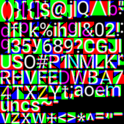

# VR UI rendering

Simple framework to demonstrate how text and basic GUI elements can be rendered in 3D environments (such as VR) with shaders.

This program utilizes multi-channel signed distance fields (MSDF) to render text efficiently and accurately on the GPU.

The method to generate MSDF textures is described in this [Master's Thesis](https://github.com/Chlumsky/msdfgen/files/3050967/thesis.pdf) authored by Viktor Chlumsk'y.

# Dependenices

- OpenGL
- stb_image: https://github.com/nothings/stb
- msdfgen: https://github.com/Chlumsky/msdfgen

# Screenshots

